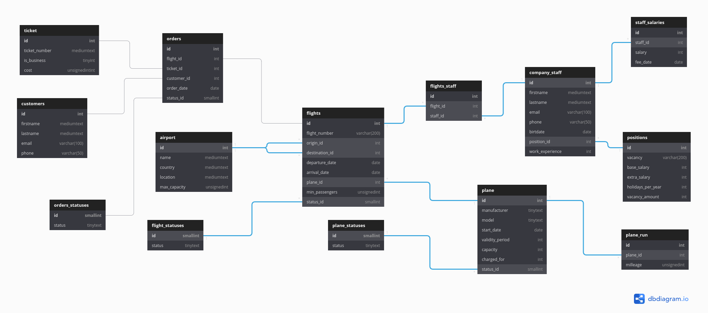

<h1>Проектирование базы данных для авиакомпании</h1>
<h2>Схема базы данных:</h2>

<a href="https://dbdiagram.io/embed/60a661f5b29a09603d15c65a">Ссылка на структуру БД</a>

<h2>Таблицы и их описание</h2>
<table>
    <tr>
        <td><b>Название таблицы</td>
        <td><b>Описание таблицы</td>
    </tr>
    <tr>
        <td>Airport</td>
        <td>Информация по каждому 
            аэропорту</td>
    </tr>
    <tr>
        <td>Company staff</td>
        <td>Информация о сотрудниках 
            компании</td>
    </tr>
    <tr>
        <td>Customers</td>
        <td>Информация о пассажирах</td>
    </tr>
    <tr>
        <td>Flight staff</td>
        <td>Принадлежность каждого
            сотрудника к определенному 
            рейсу</td>
    </tr>
    <tr>
        <td>Flight statuses</td>
        <td>Статусы полетов</td>
    </tr>
    <tr>
        <td>Flights</td>
        <td>Информация по каждому 
            рейсу</td>
    </tr>
    <tr>
        <td>Orders statuses</td>
        <td>Статусы заказов</td>
    </tr>
    <tr>
        <td>Orders</td>
        <td>Информация о заказах</td>
    </tr>
    <tr>
        <td>Plane milleage</td>
        <td>Пробег каждого самолета</td>
    </tr>
    <tr>
        <td>Plane statuses</td>
        <td>Статусы самолетов</td>
    </tr>
    <tr>
        <td>Plane</td>
        <td>Информация о каждом самолете</td>
    </tr>
    <tr>
        <td>Positions</td>
        <td>Вакансии авиакомпании</td>
    </tr>
    <tr>
        <td>Staff salaries</td>
        <td>Зарплаты сотрудников
            по месяцам</td>
    </tr>
    <tr>
        <td>Ticket</td>
        <td>Информация о каждом
            билете</td>
    </tr>
</table>

<h2>Представления и их описания</h2>
<table>
    <tr>
        <td><b>Название представления</td>
        <td><b>Описание представления</td>
    </tr>
    <tr>
        <td>Active planes</td>
        <td>Самолеты, находящиеся в 
            эксплуатации</td>
    </tr>
    <tr>
        <td>Customer orders</td>
        <td>Заказы какого-то 
            определенного клиента</td>
    </tr>
    <tr>
        <td>Estimated month salary</td>
        <td>Ожидаемая зарплата для
            каждого сотрудника</td>
    </tr>
    <tr>
        <td>Expired planes</td>
        <td>Самолеты, срок действия
            которых истек</td>
    </tr>
    <tr>
        <td>Flight crew</td>
        <td>Экипаж на определенный рейс</td>
    </tr>
    <tr>
        <td>Flight passengers</td>
        <td>Пассажиры на определенный 
            рейс</td>
    </tr>
    <tr>
        <td>Hot trips</td>
        <td>Горячие путевки</td>
    </tr>
    <tr>
        <td>Open vacancies</td>
        <td>Открытые вакансии в
            компании</td>
    </tr>
    <tr>
        <td>Ordered planes</td>
        <td>Самолеты, заказанные              авиакомпанией</td>
    </tr>
    <tr>
        <td>Planes amount</td>
        <td>Самолеты, которые есть 
        в распоряжении у авиакомпании</td>
    </tr>
    <tr>
        <td>Transfer flights</td>
        <td>Рейсы с пересадками</td>
    </tr>
</table>

